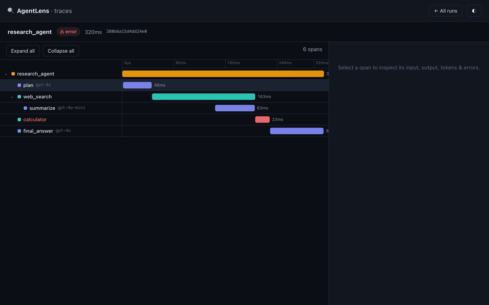
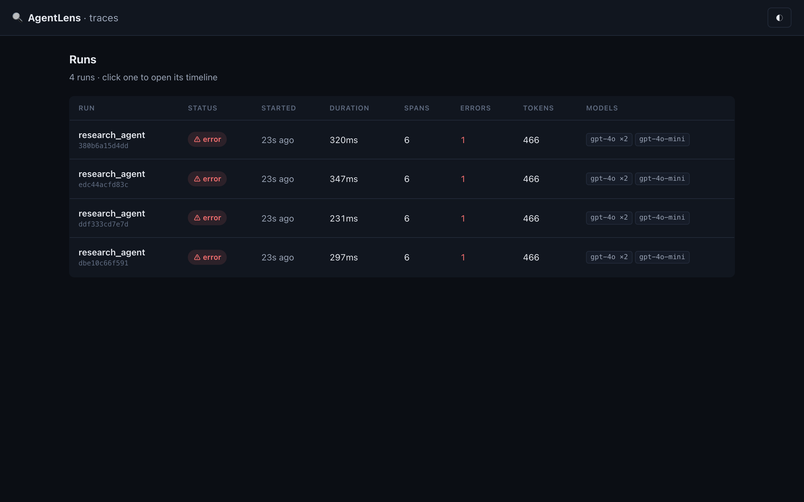
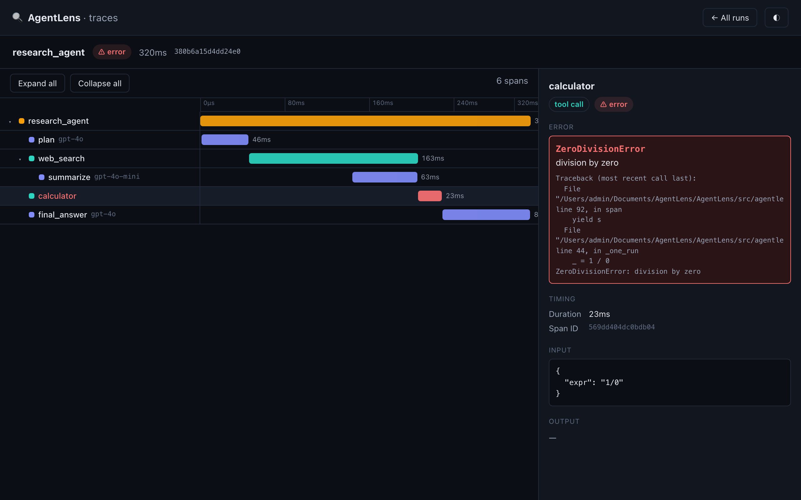

<div align="center">

# 🔍 AgentLens

### Chrome DevTools for your AI agents — fully local, zero external dependencies.

*Instrument your Python LLM agents and see every LLM call, tool call, token count, latency, and error as a collapsible timeline.*

[](https://github.com/Ranger222/AgentLens/actions/workflows/ci.yml)
[](LICENSE)
[](pyproject.toml)

</div>

---

## The problem

You're building an agent with LangChain, CrewAI, or the raw OpenAI/Anthropic
SDK. It does five things, calls the model three times, uses two tools — and when
it misbehaves you're stuck reading `print()` statements, with no idea which step
was slow, which call burned the tokens, or where the error actually came from.

**AgentLens** gives you the missing view: add a decorator, run your agent, and
open a local dashboard that shows the whole run as a collapsible timeline tree —
every span with its duration as a bar, expandable to its inputs, outputs, token
usage, and errors. Like Chrome DevTools, but for agent runs. It's MIT-licensed,
runs entirely on your machine, stores traces in a single SQLite file, and needs
no accounts, no cloud, and no API keys to try.

## Demo

The collapsible waterfall — each span positioned by time, coloured by type, with
the failed `calculator` tool in red:



<details>
<summary>More screenshots — runs list & span detail</summary>

| Runs list (status, duration, token & model rollups) | Span detail (error-first, with traceback) |
|---|---|
|  |  |

</details>

<!-- TODO: replace with an animated GIF of the full flow (runs list → waterfall → span error). -->
> Reproduce these in ~10 seconds: `agentlens demo && agentlens serve`.

## Quickstart (under 5 commands)

```bash
pip install -e ".[dev]"     # 1. install (PyPI release pending — see note below)
agentlens demo              # 2. generate a sample trace — no API keys needed
agentlens serve             # 3. open the dashboard → http://localhost:8765
```

That's it — three commands to a live, populated dashboard. To trace your own
agent, add the decorator and run it:

```python
from agentlens import trace, span

@trace                                   # records an agent_step span for the whole call
def research_agent(question: str) -> str:
    with span("search", type="tool_call", input=question) as s:
        results = web_search(question)
        s.set_output(results)            # attach output / tokens to any span
    return summarize(results)

research_agent("What is agent observability?")
# → trace written to ./agentlens.db; run `agentlens serve` to view it
```

### Auto-instrument the OpenAI / Anthropic SDKs

One call wraps every model request as an `llm_call` span (model, messages,
output, token usage) — no per-call changes:

```python
import agentlens
agentlens.instrument_openai()      # or instrument_anthropic()
# ...use the OpenAI client exactly as normal; every call is now traced.
```

## What you get

- **Frictionless SDK** — `@trace` (works on sync, async, generators &
  async-generators), a `span()` / `run()` context manager, and a manual API.
  Parent/child nesting is inferred automatically via `contextvars` — even across
  `asyncio.gather` and thread pools (`TracedThreadPoolExecutor`).
- **Framework-agnostic** — capture spans by hand anywhere, plus one-call
  auto-instrumentation for the raw OpenAI & Anthropic SDKs.
- **Local-first** — traces live in one SQLite file. No accounts, no services, no
  keys. Tracing **never crashes your app** and **never blocks** on the network.
- **Readable dashboard** — FastAPI + React (Vite). A runs list with status,
  duration, span/error/token rollups; a single run as a collapsible
  waterfall/tree with each span's duration as a bar; a detail panel for
  inputs/outputs/tokens/errors. Dark-mode by default.
- **Secrets-safe** — `api_key` / `authorization` / token values are redacted
  from captured inputs before they're ever written to disk.

## How it works

The SDK **writes** spans to SQLite; the dashboard **reads** them; SQLite's WAL
mode makes that safe with no daemon in between.

```
@trace / span()  ──writes──▶  agentlens.db (SQLite)  ◀──reads──  FastAPI + React dashboard
```

See **[docs/ARCHITECTURE.md](docs/ARCHITECTURE.md)** for the full picture and
**[docs/DATA_MODEL.md](docs/DATA_MODEL.md)** for the span schema & API.

## CLI

```bash
agentlens demo [-n N] [--seed S]   # write N sample runs (no API keys)
agentlens serve [--port 8765]      # launch the dashboard (opens your browser)
agentlens info                     # show the trace DB path + run count
agentlens version
```

The trace DB is resolved as: `--db` → `$AGENTLENS_DB` → `./agentlens.db` →
`~/.agentlens/agentlens.db`. The SDK prints the resolved path on first write.

## Documentation

| Doc | What's in it |
|---|---|
| [docs/ARCHITECTURE.md](docs/ARCHITECTURE.md) | Components, nesting model, reliability principles |
| [docs/DATA_MODEL.md](docs/DATA_MODEL.md) | Span/Run schema, SQLite DDL, HTTP API, waterfall math |
| [docs/WORKFLOW.md](docs/WORKFLOW.md) | Dev loop, the verify harness, testing strategy |
| [docs/ROADMAP.md](docs/ROADMAP.md) | What shipped in v1; deferred items + rationale |
| [docs/RESEARCH_SYNTHESIS.md](docs/RESEARCH_SYNTHESIS.md) | The research brief that informed the design |
| [CONTRIBUTING.md](CONTRIBUTING.md) | Setup and the green-gate before a PR |

## Development

```bash
make venv install install-frontend   # set up
make verify                           # the full green-gate (lint+types+tests+build+e2e)
```

`./scripts/verify.sh` is the single source of truth for "is the build green?" —
the same gates run in CI on every push and PR.

## Status & install note

v1 is feature-complete and fully tested (129 Python tests + 15 frontend tests,
CI across Python 3.9–3.12). A PyPI release is pending: the brand and CLI are
**AgentLens** / `agentlens`, but the PyPI *distribution* name `agentlens` is
already taken by an unrelated package, so the published name will differ (the
import + command stay `agentlens`). Until then, install from source with
`pip install -e ".[dev]"`. See [docs/ROADMAP.md](docs/ROADMAP.md).

## License

[MIT](LICENSE) © 2026 Piyush Singh Tomar
